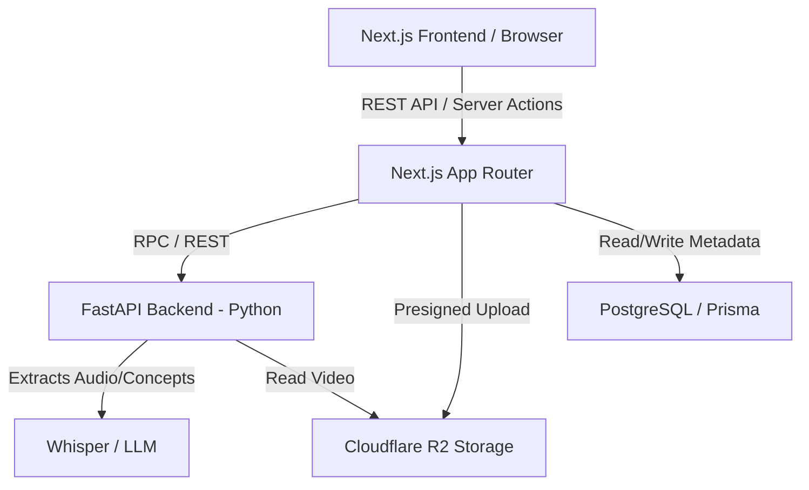

# LectureGraph Implementation Plan & Timeline

LectureGraph is a multimodal learning platform that "unfolds" video lectures into interactive 2D knowledge graphs. This plan outlines a 5-iteration approach to build the MVP.

## Proposed Timeline (5 Iterations)

### Iteration 1: Local Foundation & Extraction (Phase 1)
**Goal**: Convert local MP4 to concept-tagged JSON using Whisper.
- Set up Python environment with Whisper and PyTorch.
- Implement transcription script that extracts word-level timestamps.
- Create a basic "Concept Extractor" script that uses a local LLM or API (GPT-4o/Gemini) to identify key terms from the transcript.
- **Deliverable**: A CLI tool that takes `lecture.mp4` and outputs `metadata.json`.

### Iteration 2: Cloud Infrastructure & Storage (Phase 2)
**Goal**: Move from local files to scalable cloud storage.
- Configure Cloudflare R2 bucket.
- Set up Next.js project structure with Tailwind CSS and Prisma.
- Implement secure file upload to R2 (presigned URLs).
- Set up PostgreSQL (via Supabase or local Docker) for node/edge storage.
- **Deliverable**: Web interface to upload a video and see it appear in R2.

### Iteration 3: Web Application & Video Linkage (Phase 3-4)
**Goal**: Build the core side-by-side interface.
- Implement the Next.js Video Player component using the R2 stream.
- Create a "Timeline View" (list of concepts) that syncs with the video player.
- Logic: Clicking a concept `seekTo` the timestamp in the MP4.
- **Deliverable**: Functional web player where users can skip to sections based on a text list of concepts.

### Iteration 4: Semantic Graph Integration (Phase 4-5)
**Goal**: Transform the text list into a dynamic knowledge graph.
- Integrate `react-force-graph` for the 2D visualization.
- Implement the "Relationship Mapping" logic:
    - LLM (GPT-4o-mini) analyzes the sequence of concepts to determine "Prerequisite" or "Related" connections.
    - Store these as "Edges" in the database.
- Connect the Graph nodes to the Video Player `seekTo` controls.
- **Deliverable**: Interactive 2D graph that controls the video playback.

### Iteration 5: Polish & Deployment (Phase 5+)
**Goal**: Visual excellence and production readiness.
- Apply "Rich Aesthetics": Glassmorphism, Framer Motion animations, and dark mode.
- Implement user authentication (optional but recommended for saving graphs).
- Deploy to Vercel and set up GitHub Actions.
- **Deliverable**: Production-ready LectureGraph application.

## System Architecture

LectureGraph uses a **Dual-Service Architecture** to leverage the strengths of both Python (AI/ML) and Node.js (Web/UI).

### 1. The Next.js Role (The Orchestrator)
- **UI/UX**: Renders the dashboard, video player, and knowledge graph.
- **Auth & Database**: Handles user authentication and manages the `Nodes` and `Edges` tables via Prisma.
- **Client Actions**: When a user uploads a video, Next.js generates a Cloudflare R2 presigned URL.

### 2. The FastAPI Role (The AI Engine)
- **Heavy Lifting**: Runs the Python-based AI pipeline (Whisper for transcription, LLMs for entity extraction).
- **Processing Queue**: When a video finishes uploading, Next.js notifies FastAPI to start processing.
- **Stateless**: FastAPI processes the data and sends the resulting JSON back to Next.js or saves it directly to the DB.

### 3. Why this split?
- **Whisper/PyTorch**: These are native to Python. Running them in a Node.js environment is cumbersome and performant-heavy.
- **Next.js**: Provides the best-in-class frontend experience and seamless database integration with Prisma.

## Verification Plan

### Automated Tests
- Script to verify Whisper output accuracy on short clips.
- Unit tests for R2 upload/download logic.
- Integration tests for Prisma queries.

### Manual Verification
- Upload a 10-minute lecture and verify the graph accurately reflects the "Slide Changes" and "Keywords".
- Verify that clicking a node at the 5:00 mark accurately moves the video player to word-level start.
